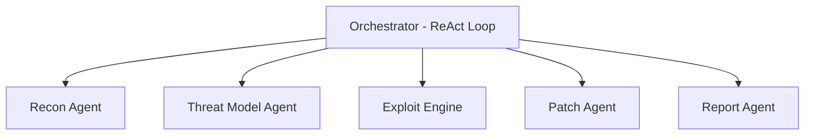

<div align="center">
  <h1>👻 PHANTOM</h1>
  <p><strong>Autonomous, Explainable, AI-Powered Red Team Agent</strong></p>
  <p>Pentesting Heuristic Agent with Multi-Tool Network</p>
</div>

---

## 🚀 The Problem with Penetration Testing Today
Organizations are exposed. Testing is too expensive, too slow, and too rare.
- **Unaffordable**: External pentest agencies charge massive fees (₹50K–₹5L per engagement), leaving SMEs and colleges without budget.
- **Too Slow**: Manual assessments take 3–10 business days. Findings are outdated before the report is delivered in fast-paced CI/CD pipelines.
- **Compliance Gaps**: Certifications like ISO 27001, SOC 2, and PCI-DSS require continuous evidence of testing, not just annual snapshots.

### 💡 The PHANTOM Solution
PHANTOM is an AI-powered red team agent that identifies vulnerabilities, reasons through attack chains, and delivers production-ready patches—no external consultant required. 
- **10× faster** than a manual pentest.
- **90% cost reduction** compared to traditional agencies.
- **24/7 continuous threat coverage** embedded directly into your pipeline.

---

## 🎯 Who PHANTOM Serves

1. **Educational Institutions (Universities, Colleges, Schools)**
   - Protects student data and fee portals without requiring an external pentest budget or dedicated red-team training.
2. **SMEs & Startups (< 500 employees)**
   - Scales with the business using API costs instead of full consultant fees. Provides security posture evidence for investors.
3. **Compliance-Driven Orgs (ISO 27001, SOC 2, PCI-DSS)**
   - Generates auditable reports with full reasoning chains—exactly what ISO assessors want.
4. **Internal IT / DevSecOps Teams**
   - Shifts security left. Integrates into deployment pipelines to catch vulnerabilities *before* production, delivering findings into the developer workflow.

---

## 🧠 System Architecture

PHANTOM consists of **5 specialized agents**, orchestrated by a **ReAct loop**, and backed by **ChromaDB vector memory**. Every action occurs within a Sandboxed Execution Zone to prevent accidental damage and guard against prompt injection.



### 1️⃣ Recon Agent (Surface Mapping)
The first step in the pipeline. It builds a complete, structured model of the attack surface (codebase, network, endpoints) without sending any destructive payloads.
- **Passive Track**: Queries **Shodan** for publicly known ports, CVEs, SSL certificates, and headers. (Zero noise).
- **Active Track**: Uses **nmap** (intensity 7) for targeted profiling based on passive intelligence.
- **Output**: Generates a structured Attack Surface Model (JSON) outlining external unauthenticated ports, dependency CVEs, and entry points.

### 2️⃣ Threat Model Agent (Classification)
Takes raw recon data and answers: *What can an attacker actually do with this?*
- **MITRE ATT&CK Mapping**: Maps findings to STIX 2.0 classifications (e.g., *T1059.006 - Command & Scripting: Python*).
- **STRIDE Classification**: Applies deterministic labels (Spoofing, Tampering, Repudiation, Information Disclosure, Denial of Service, Elevation of Privilege).
- **Kill Chain Positioning**: Calculates how many steps an attacker needs to reach critical impact (e.g., Recon → Initial Access → Execution).

### 3️⃣ Exploit Engine (Attack & Self-Correct)
Receives prioritized findings and attempts to confirm whether each vulnerability is genuinely exploitable.
- **Static Analysis**: Uses **Semgrep** (pattern matching) and **Bandit** (AST-level analysis) to hypothesize vulnerabilities.
- **Dynamic Self-Correction Loop**: If an exploit fails (e.g., blocked by WAF), the agent reads the failure signal, classifies it, and intelligently pivots (e.g., switches to encoding variants or blind extraction).
- **Confidence Scoring**: Maintains a fractional confidence score across attempts. Triggers human-in-the-loop escalation at exactly `0.70` for potentially destructive payloads.

### 4️⃣ Patch Agent (CVE Remediation)
Receives a confirmed exploit and writes a verified, production-ready fix.
- **Remediation Strategy Ranking**: Generates up to three patch candidates graded on root cause mitigation vs. symptom blocking, code change surface, and regression risk.
- **Anti-Regression Scanning**: Passes every generated patch back through **Bandit** *before* submission to ensure no new vulnerabilities were introduced.
- **Signatures**: Signs the final patch using a SHA-256 hash containing the diff content, session ID, and timestamp.

### 5️⃣ Report Agent (Audit Trail)
Queries the append-only memory store to generate three distinct reporting layers:
1. **Executive Summary**: For the CISO. Plain language, business risk, and priority actions.
2. **Technical Findings**: For the developer. Code-level details, structured patch diffs, and jargon-free explanations to fix the root cause.
3. **Audit Trail**: For the ISO Auditor. A SHA-256 hash-chained log of every action, tool call, pivot, and attempt. Tamper-evident and explicitly details *unconfirmed* findings.

---

## 🔒 Security & Guardrails
- **Sentinel Token Locking**: LLM context is strictly controlled. Anomalous tool outputs are hard-rejected.
- **Docker + Seccomp Isolation**: Tools run in single-use containers with highly restricted syscalls (no `ptrace`, `mount`, or `chroot`).
- **Human-in-the-loop Gates**: Agent pauses before destructive actions for manual approval. Patches are never auto-applied.
- **Strict Pydantic Validation**: All outputs are rigorously validated to prevent silent LLM hallucinations.
- **SHA-256 Audit Log Chaining**: Hash-chained entries provide verifiable compliance evidence.

---

## 🛠 Tech Stack
- **Core Engine**: `Python 3.11+`
- **AI Brain**: `anthropic` (Claude API — *claude-3-5-haiku* for high-speed demo reasoning)
- **Memory**: `chromadb` (Local Vector memory for session learning)
- **Security Tools**: `python-nmap`, `semgrep`, `bandit`
- **Recon APIs**: `requests` (NVD API, Shodan API, MITRE ATT&CK)
- **Infrastructure**: `fastapi`, `uvicorn`, `rich` (Terminal streaming UI)

---

## ⚙️ Getting Started (Local Demo)

### 1. Requirements
Ensure you have `nmap` installed on your machine (`sudo apt-get install nmap`, `brew install nmap`, or download the windows binary).

### 2. Installation
```bash
git clone https://github.com/ANONYMO943/PHanTom-Agentic-Red-teamining-AI-agents.git
cd PHanTom-Agentic-Red-teamining-AI-agents/PHANTOM-main
pip install -r requirements.txt
```

### 3. Environment Variables
Copy the `.env.example` file to `.env` and fill in your keys (NEVER commit this file):
```bash
cp .env.example .env
```
Add the following to `.env`:
```env
ANTHROPIC_API_KEY=your_key_here
SHODAN_API_KEY=your_key_here
NVD_API_KEY=your_key_here
```

### 4. Run the Demo
```bash
python main.py
```
*Note: The demo runs against a local sandboxed Flask application containing intentional SSTI & SQLi vulnerabilities for evaluation.*
